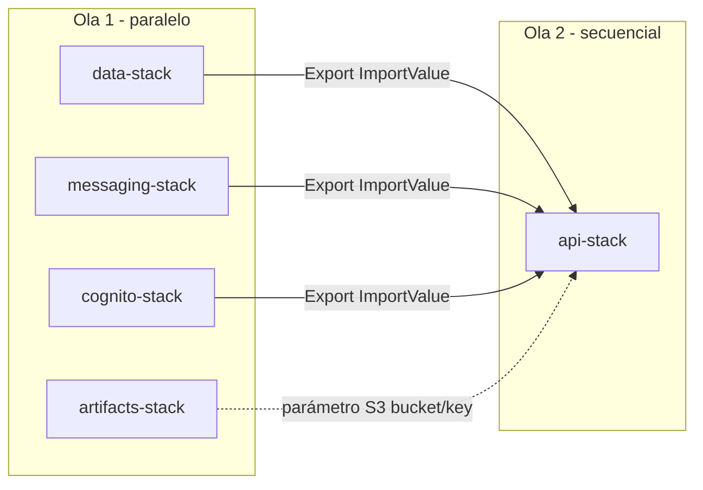

# CloudFormation — stacks segmentados

La infraestructura se divide en **plantillas independientes** para:

1. **Evitar dependencias circulares** y fallos por recursos aún no creados (p. ej. Lambda que referencia una tabla inexistente).
2. **Paralelizar** en el pipeline lo que no tiene orden estricto (datos vs mensajería vs artefactos).
3. **Desacoplar ciclos de vida**: cambiar la API sin tocar tablas; retener datos al eliminar la API.

**Convención:** nombres de recursos **fijos por cuenta** (`apip-core`, `apip-api`, etc.). Se asume **una cuenta AWS por entorno** (dev / stg / prd en cuentas distintas).

Los roles **OIDC de GitHub** y políticas IAM compartidas entre repos deben vivir en **`apip-policies`**; la Lambda del `api-stack` ahora usa `AWSAPIPLambdaExecutionRole` (rol gestionado en `apip-policies`) en vez de crear un rol inline propio.

## Diagrama de dependencias



- **Ola 1:** `data-stack`, `messaging-stack`, `artifacts-stack`, **`cognito-stack`** no dependen entre sí.
- **Ola 2:** `api-stack` importa datos, mensajería y Cognito (`Fn::ImportValue`). El ZIP de Lambda se pasa como **parámetro** `LambdaCodeBucket` / `LambdaCodeKey` (p. ej. subido por el pipeline).

## Orden recomendado (CLI)

```bash
aws cloudformation deploy --stack-name apip-data --template-file stacks/data-stack.yaml --capabilities CAPABILITY_NAMED_IAM
aws cloudformation deploy --stack-name apip-messaging --template-file stacks/messaging-stack.yaml --capabilities CAPABILITY_NAMED_IAM
aws cloudformation deploy --stack-name apip-artifacts --template-file stacks/artifacts-stack.yaml --capabilities CAPABILITY_NAMED_IAM
aws cloudformation deploy --stack-name apip-cognito --template-file stacks/cognito-stack.yaml
# Subir lambda.zip al bucket y luego:
aws cloudformation deploy --stack-name apip-api --template-file stacks/api-stack.yaml \
  --parameter-overrides LambdaCodeBucket=... LambdaCodeKey=... \
  --capabilities CAPABILITY_NAMED_IAM
```

**Importante:** `api-stack` fallará si **no existen** los exports de `data-stack`, `messaging-stack` y **`cognito-stack`** en la misma cuenta y región.

## Exports (nombres)

| Export | Productor |
|--------|-----------|
| `apip-core-table-name` | data-stack |
| `apip-core-table-arn` | data-stack |
| `apip-audit-table-name` | data-stack |
| `apip-audit-table-arn` | data-stack |
| `apip-event-bus-name` | messaging-stack |
| `apip-event-bus-arn` | messaging-stack |
| `apip-lambda-artifacts-bucket-name` | artifacts-stack (opcional) |
| `apip-cognito-user-pool-id` | cognito-stack |
| `apip-cognito-app-client-id` | cognito-stack |

## Autenticación (Cognito + JWT en la API)

`cognito-stack` crea el **User Pool** (`apip-users`), un **app client** y exporta IDs. El `api-stack` enlaza el authorizer JWT vía **`Fn::ImportValue`** (sin parámetros manuales de Cognito).

- El cliente envía `Authorization: Bearer <token>`. Suele usarse el **ID token** (`aud` = app client).
- Rutas **sin** JWT: `GET /health` y `OPTIONS /{proxy+}`.
- El pool define el atributo personalizado **`custom:tenantId`** (mutable) para alinearlo con `src/auth/context.ts`.

## Stacks futuros (no incluidos aún)

- **observability** (alarmas, dashboards): paralelo o tras API.
- **networking** (VPC, endpoints): solo si Lambdas en VPC.

## Plantilla monolítica

El archivo `template.yaml` en la raíz de `cloudformation` quedó **reemplazado** por `stacks/`; no se mantiene un monolito para evitar duplicar fuentes de verdad.
